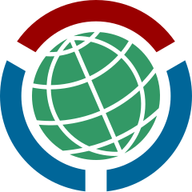

#  Gravminne-referanser

Dette er en utvidelse ("extension") til nettleseren Google Chrome som hjelper deg med å lage referanser fra [Wikidata](https://www.wikidata.org/wiki/Wikidata:Main_Page) (databasen som brukes til å lage faktaboksene om personer på Wikipedia) til [Slekt og Data Gravminnebasen](https://www.slektogdata.no/gravminner). Utvidelsen hjelper deg med å formatere disse referansene riktig, og sparer deg som Wikidata-bidragsyter for mye manuell tasting.

## Installasjon

<!-- TODO: Add chrome extension link inside parenthesis -->

(Kommer snart)

## Bruk

(Kommer snart)

## Endringslogg

Alle nye versjoner av utvidelsen er listet under.

### [1.0.0] - 16. august 2021

Dette er den første versjonen som har blitt lastet opp til Chrome Nettmarked / Web Store. All funksjonaliteten ser ut til å fungere bra, men første versjon av nye programvare innheolder som regel noen feil.

## Hvordan bidra

Instruksjonene under hjelper deg med å komme i gang med å bidra til utviklingen av denne utvidelsen.

### Bygg prosjektet lokalt

1. Installer [Node.js](https://nodejs.org/en/). Enhver versjon fra de siste par årene burde fungere. Hvis du er i tvil om versjonen du skal velge er det tryggest å velge siste LTS-release.
2. Klon kildekoden til prosjektet.
3. Fra kommandolinjen, gå til prosjekt-mappen og kjør `npm install`
4. Kjør kommandoen `npm run build`

Når du nå gjør en endring i kildekoden og lagrer vil Webpack bygge en ny versjon som du kan teste i den lokale Chrome-nettlseren din. Den nybygde versjonen havner i `build`-mappen under prosjektet. See [Googles dokumentasjon](https://developer.chrome.com/docs/extensions/mv3/getstarted/) for hvordan man setter opp utvikler-modus i Chrome, slik at man kan prøve den endrede utvidelsen lokalt.

### Lag en pull-request

Når du har gjort endringene dine kan du lage en pull-request på Github. Kjør gjerne kommandoen `npm run prettier` først, for å autoformatere koden etter gjeldende standarder for prosjektet.

Merk at navn på funksjoner, variable o.l. i kildekoden skal være på engelsk, mens alle meldinger som brukerne ser skal være på norsk.

Prosjektet er laget med [Chrome Extension CLI](https://github.com/dutiyesh/chrome-extension-cli) og [Webpack](https://webpack.js.org/). Hvis du legger til nye filer kan det hende du må oppdatere Webpack-konfigurasjonen med en linje eller to. Dette skal være relativt rett frem dersom du følger det eksisterende mønsteret.

## Ofte stilte spørsmål (FAQ)

- Kan du porte utvidelsen til Firefox?
  - Utvidelsen har en _veldig_ smal brukerbase, man kan nok telle brukerne på fingrene. Jeg skal være veldig sikker på at det finnes mange med Firefox som har et behov for å legge inn referanselenker til Slekt og Data Gravminnebasen før jeg eventuelt gjør noe slikt.

## Kontakt

Denne utvidelsen er skrevet av Wikipedia-brukeren Kjetil Ree. Ta gjerne kontakt derosm noe ikke virker, eller om du har andre innspill. Wikipedia-brukere kan bruke [brukerdiskusjonssiden min på Wikipedia](https://no.wikipedia.org/wiki/Brukerdiskusjon:Kjetil_r) til dette.
